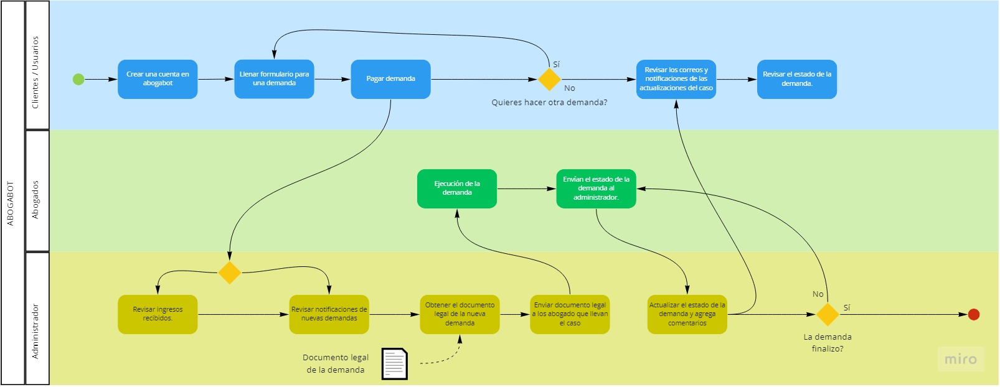

### DESCRIPCIÓN GENERAL DEL REQUERIMIENTO

| Campo | Descripción |
| ------------ | ------------ |
| Nombre del proyecto  | Abogabot  |
| Nombre del requerimiento  | Proceso de automatización de demandas |
| Fechas de Solicitud | 18/02/2022  |
| Responsables(s) de la solicitud  | Harvey R. Specter  |
| Dependencia(s) solicitante  | Person Specter LLC  |
| Responsable Funcional designado por el equipo de desarrollo de software | Leonel Olivares Conchillos  |

### FASE DE FORMALIZACIÓN
##### DESCRIPCIÓN DE LA SOLICITUD

###### Usuario Solicitante
Queremos una página web donde nuestros clientes puedan llenar un formulario con todos los datos necesarios para realizar una demanda y también realizar el pago de ella. Nuestros clientes deben tener la posibilidad de darle seguimiento a la demanda y que reciban notificaciones y correos electrónicos de cada actualización del proceso legal. Queremos que a partir del formulario se genere de manera automática el documento legal que utilizaremos para empezar el proceso de la demanda, de preferencia necesitamos que el documento se encuentre en formato Word.
El encargado de la plataforma en el despacho deberá recibir notificaciones de cada demanda que se realice. Él se encargará de actualizar el estado de la demanda, desde la creación hasta el cierre de esta, y agregará los comentarios del nuevo estado de la demanda que surgieron durante el proceso legal, esta información lo que podrá ver el usuario. Por último, el encargado podrá visualizar el total de las demandas junto con los pagos de cada una para poder obtener el total de ingresos recibidos. 

###### Líder Funcional
Se solicita una página web para automatizar el proceso de demandas en una firma de abogados. Los usuarios podrán crear una cuenta con la que podrán realizar demandas llenando un formulario y haciendo el pago de este, también podrán ver el total de las demandas que han realizado y podrán dar seguimiento viendo el estado y comentarios de cada actualización de la demanda.
El administrador podrá ver todas las demandas solicitadas, podrá obtener el documento legal de cada demanda que se generará de manera automática a partir del formulario que contestan los usuarios, tendrá un dashboard con los pagos de todas las demandas donde se podrá visualizar el total de ingresos recibidos y también podrá actualizar los estados de las demandas y agregar comentarios.
Los usuarios recibirán notificaciones y correos electrónicos de cada actualización del estado de su demanda y los administradores recibirán notificaciones cada vez que se solicite una demanda.

### ANALISIS DE REQUISITOS Y REQUERIMIENTOS
#####Modelo de negocio
[]
##### Requerimientos Funcionales
- Los usuarios podrán crear una cuenta en el sistema con sus datos personales, correo y contraseña.
- El sistema permitirá llenar el formulario solo a los usuarios con cuenta.
- El sistema redirigirá al usuario al proceso de pago una vez que haya terminado el llenado del formulario.
- Los usuarios podrán ver el estado de las demandas que hayan realizado.
- Los usuarios podrán ver los comentarios que se agregan con cada actualización del estado de la demanda.
- Los usuarios recibirán un correo electrónico cada vez que haya una actualización del estado de la demanda.
- El administrador recibe las notificaciones de las nuevas demandas.
- El sistema generará un documento legal con la información del formulario.
- El administrador podrá descargar el documento legal para su uso en la firma.
- El administrador podrá acceder a cada demanda para actualizar el estado de la demanda y agregar comentarios.
- El administrador podrá visualizar los pagos de cada demanda en un dashboard para ver la cantidad de ingresos recibidos.

##### Requerimientos no funcionales
- La página web debe ser responsive.
- La página web debe tener una combinación de colores de azul marino y blanco.
- El sistema no debe perder la información capturada en el formulario si se regresa a este después de pasar al proceso de pago.
- El sistema debe ser capaz de operar adecuadamente con hasta 10.000 usuarios con sesiones concurrentes.
- Si se identifican ataques de seguridad o brecha del sistema, el mismo no continuará operando hasta ser desbloqueado por un administrador de seguridad.
- El tiempo de aprendizaje del sistema por un usuario deberá ser menor a 1 hora.
- El sistema debe tener una disponibilidad del 99,99% de las veces en que un usuario intente accederlo.
- El tiempo para iniciar o reiniciar el sistema no podrá ser mayor a 5 minutos.

##### Requisitos Técnicos
| Campo | Descripción |
| ------------ | ------------ |
| Tipo de desarrollo | WebApp  |
| Tipo de base de datos  | SQL Server |
| Lenguajes | HTML, CSS, JavaScript, Java |